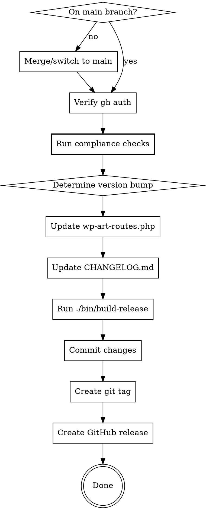

# Art Routes Release

## Overview

This skill guides the complete release process for the Art Routes WordPress plugin: version increment, changelog update, compliance checks, build, and GitHub release creation.

## When to Use

- User requests a new release
- User wants to bump the version
- User mentions "release", "version", "publish", or "deploy"

## Quick Reference

| Step | Files/Commands |
|------|----------------|
| Version format | `X.Y.Z` (semantic versioning, e.g., `2.0.0`) |
| Version locations | `wp-art-routes.php` (2 places: header + constant), `readme.txt` (Stable tag) |
| Changelog | `CHANGELOG.md` (full entry), `readme.txt` (condensed entry) |
| README.md | Update if user-facing features changed |
| Compliance | CDN check, WordPress.org requirements |
| Build | `./bin/build-release` |
| GitHub release | `gh release create` with zip attachment |

## Release Process



### 0. Pre-Release Checks

**Branch:** Releases should be made from `main` branch. If on a feature branch:
1. Ask user: "You're on branch X. Should I merge to main first, or release from this branch?"
2. If merging: `git checkout main && git merge <branch> && git push`

**GitHub Auth:** Run `gh auth status`. If not authenticated, stop and ask user to run `gh auth login`.

### 0.5. Compliance Checks (CRITICAL)

**Run these checks BEFORE proceeding to avoid post-release hotfixes:**

#### Quick Checks (run from plugin directory):

1. **CDN Check:** No external CDN resources (except Google Fonts)
   ```bash
   grep -r "cdn\." --include="*.php" --include="*.js" . | grep -v node_modules | grep -v .git
   ```
   - If any CDN links found (other than fonts), they must be bundled locally
   - Leaflet.js must be in `assets/lib/leaflet/`

2. **WordPress.org Requirements:**
   - Plugin name must be "Art Routes" (no "WP" - trademark restriction)
   - readme.txt must have maximum 5 tags
   - "Tested up to" should match current WordPress version
   - Check: `grep "Tags:" readme.txt` (count comma-separated values)

3. **Output Escaping Spot Check:**
   ```bash
   grep -r "_e(" --include="*.php" . | grep -v "esc_" | head -5
   ```
   - All `_e()` should be `esc_html_e()` or `esc_attr_e()`

#### Full Plugin Check (recommended before major releases):

```bash
./bin/plugin-check
```

This script:
1. Builds the release package (clean files only)
2. Copies to `art-routes-check` in plugins directory
3. Provides wp-cli command to run in Local's Site Shell

For Local by Flywheel, open Site Shell and run:
```bash
wp plugin check art-routes-check --require=./wp-content/plugins/plugin-check/cli.php
```

If any compliance issues are found, fix them BEFORE continuing with the release.

### 1. Determine Version Bump

Ask user for bump type if not specified:
- **Major** (X.0.0): Breaking changes, major rewrites
- **Minor** (X.Y.0): New features, enhancements
- **Patch** (X.Y.Z): Bug fixes, small improvements

### 2. Update Version in wp-art-routes.php

Update BOTH locations:

```php
// Header comment (line ~7)
* Version: X.Y.Z

// Constant definition (line ~26)
define('WP_ART_ROUTES_VERSION', 'X.Y.Z');
```

### 3. Update CHANGELOG.md

Add new entry after the versioning note paragraph, before the first `## [X.` entry or the historical releases section:

```markdown
## [X.Y.Z] - YYYY-MM-DD

### Added
- Feature description

### Changed
- Change description

### Fixed
- Fix description
```

**Date:** Use today's date in `YYYY-MM-DD` format.

**Content sources (in priority order):**
1. User-provided release message/description
2. Git commits since last release: `git log --oneline $(git describe --tags --abbrev=0 2>/dev/null || echo HEAD~10)..HEAD`
3. Ask user if unclear

Use only relevant sections (Added/Changed/Fixed). Omit empty sections.

**Tip:** Extract changelog section for GitHub release notes later:
```bash
sed -n '/^## \[X.Y.Z\]/,/^## \[/p' CHANGELOG.md | head -n -1
```

### 4. Update readme.txt

Update the WordPress.org readme file:

1. **Stable tag:** Update to new version number
2. **Changelog section:** Add condensed changelog entry at top
3. **Upgrade Notice:** Add entry if significant changes
4. **Features list:** Update if new user-facing features added

```
Stable tag: X.Y.Z

== Changelog ==

= X.Y.Z =
* Brief description of changes
```

### 5. Update README.md (if needed)

If user-facing features changed:
- Update version number in header
- Update Features list
- Add usage documentation for new features

### 6. Build Release Package

```bash
./bin/build-release
```

Creates: `build/wp-art-routes-X.Y.Z.zip`

### 7. Commit and Tag

```bash
git add wp-art-routes.php CHANGELOG.md readme.txt README.md
git commit -m "Release X.Y.Z"
git tag X.Y.Z
git push origin HEAD --tags
```

### 8. Create GitHub Release

```bash
gh release create X.Y.Z \
  --title "Art Routes X.Y.Z" \
  --notes-file - \
  build/wp-art-routes-X.Y.Z.zip <<'EOF'
## Changes

[Paste relevant CHANGELOG section here]

## Installation

Download the zip file and install via WordPress Admin > Plugins > Add New > Upload Plugin.
EOF
```

## Common Mistakes

| Mistake | Fix |
|---------|-----|
| Skipping compliance checks | Always run CDN and WordPress.org checks BEFORE tagging |
| CDN resources not bundled | Bundle all JS/CSS locally (see assets/lib/) |
| Plugin name contains "WP" | Use "Art Routes" not "WP Art Routes" (trademark) |
| Too many tags in readme.txt | Maximum 5 tags allowed by WordPress.org |
| Only updating one version location | Update ALL: wp-art-routes.php (2 places) + readme.txt Stable tag |
| Using old wenb- prefix | Version format is now `X.Y.Z` (semantic versioning) |
| Forgetting readme.txt | Update Stable tag + add changelog entry |
| Wrong changelog date format | Use `YYYY-MM-DD` |
| Forgetting to build before release | Build creates the zip for GitHub |
| Pushing before building | Build first, commit, then push+release |
| Releasing from feature branch | Releases typically from `main` - merge first |
| gh not authenticated | Run `gh auth status` before starting |

## Verification Checklist

Before creating release:
- [ ] On main branch (or user confirmed feature branch release)
- [ ] `gh auth status` shows logged in
- [ ] **Compliance: No CDN resources** (grep check passed)
- [ ] **Compliance: Plugin name is "Art Routes"** (no "WP")
- [ ] **Compliance: readme.txt has ≤5 tags**
- [ ] Version updated in wp-art-routes.php header (line ~7)
- [ ] Version updated in WP_ART_ROUTES_VERSION constant (line ~26)
- [ ] CHANGELOG.md has entry with correct version and date
- [ ] readme.txt `Stable tag` updated to new version
- [ ] readme.txt changelog section has new entry
- [ ] README.md version updated (if applicable)
- [ ] `./bin/build-release` ran successfully
- [ ] Zip file exists in build/ directory

## WordPress.org Submission

After GitHub release, if submitting to WordPress.org:
1. Download the zip from GitHub release
2. Install [Plugin Check](https://wordpress.org/plugins/plugin-check/) on a test site
3. Upload and activate the plugin from the zip
4. Run Plugin Check - fix any errors (warnings can be reviewed)
5. Submit at https://wordpress.org/plugins/developers/add/
6. After approval, use SVN to publish updates
