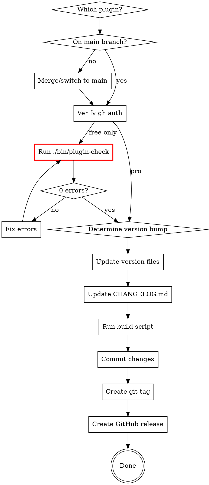

# Art Routes Release

## Overview

This skill guides the complete release process for Art Routes plugins: version increment, changelog update, compliance checks, build, and GitHub release creation. Supports both the free plugin and the pro add-on.

## When to Use

- User requests a new release
- User wants to bump the version
- User mentions "release", "version", "publish", or "deploy"

## Step 0: Determine Which Plugin

Ask user which plugin to release (if not specified):
- **Art Routes (Free)** - WordPress.org distribution
- **Art Routes Pro** - Premium distribution

## Quick Reference

### Free Plugin

| Step | Files/Commands |
|------|----------------|
| Version format | `X.Y.Z` (semantic versioning) |
| Version locations | `plugins/wp-art-routes/wp-art-routes.php` (2 places: header + constant), `plugins/wp-art-routes/readme.txt` (Stable tag) |
| Changelog | `plugins/wp-art-routes/CHANGELOG.md` (full entry), `plugins/wp-art-routes/readme.txt` (condensed entry) |
| README.md | Update `plugins/wp-art-routes/README.md` if user-facing features changed |
| Compliance | CDN check, WordPress.org requirements |
| Build | `./bin/build-free` |
| Tag format | `vX.Y.Z` |
| GitHub release | `gh release create` with zip attachment |

### Pro Plugin

| Step | Files/Commands |
|------|----------------|
| Version format | `X.Y.Z` (semantic versioning) |
| Version locations | `plugins/art-routes-pro/art-routes-pro.php` (2 places: header + constant) |
| Build | `./bin/build-pro` |
| Tag format | `pro-vX.Y.Z` |
| GitHub release | `gh release create` with zip attachment |

## Release Process



### 0. Pre-Release Checks

**Branch:** Releases should be made from `main` branch. If on a feature branch:
1. Ask user: "You're on branch X. Should I merge to main first, or release from this branch?"
2. If merging: `git checkout main && git merge <branch> && git push`

**GitHub Auth:** Run `gh auth status`. If not authenticated, stop and ask user to run `gh auth login`.

### 0.5. Compliance Checks (Free Plugin Only - CRITICAL)

**Run these checks BEFORE proceeding to avoid post-release hotfixes:**

#### Quick Checks:

1. **CDN Check:** No external CDN resources (except Google Fonts)
   ```bash
   grep -r "cdn\." --include="*.php" --include="*.js" plugins/wp-art-routes/ | grep -v node_modules | grep -v .git
   ```

2. **WordPress.org Requirements:**
   - Plugin name must be "Art Routes" (no "WP" - trademark restriction)
   - readme.txt must have maximum 5 tags
   - "Tested up to" should match current WordPress version
   - Check: `grep "Tags:" plugins/wp-art-routes/readme.txt` (count comma-separated values)

3. **Output Escaping Spot Check:**
   ```bash
   grep -r "_e(" --include="*.php" plugins/wp-art-routes/ | grep -v "esc_" | head -5
   ```

#### Full Plugin Check (REQUIRED before free plugin releases):

```bash
./bin/plugin-check
```

**The script must pass with 0 errors before releasing.**

### 1. Determine Version Bump

Ask user for bump type if not specified:
- **Major** (X.0.0): Breaking changes, major rewrites
- **Minor** (X.Y.0): New features, enhancements
- **Patch** (X.Y.Z): Bug fixes, small improvements

### 2. Update Version

#### Free Plugin
Update BOTH locations in `plugins/wp-art-routes/wp-art-routes.php`:

```php
// Header comment (line ~7)
* Version: X.Y.Z

// Constant definition (line ~26)
define('WP_ART_ROUTES_VERSION', 'X.Y.Z');
```

#### Pro Plugin
Update BOTH locations in `plugins/art-routes-pro/art-routes-pro.php`:

```php
// Header comment (line ~7)
* Version: X.Y.Z

// Constant definition (line ~20)
define( 'ART_ROUTES_PRO_VERSION', 'X.Y.Z' );
```

### 3. Update CHANGELOG.md (Free Plugin)

Add new entry in `plugins/wp-art-routes/CHANGELOG.md` after the versioning note paragraph:

```markdown
## [X.Y.Z] - YYYY-MM-DD

### Added
- Feature description

### Changed
- Change description

### Fixed
- Fix description
```

**Date:** Use today's date in `YYYY-MM-DD` format.

**Content sources (in priority order):**
1. User-provided release message/description
2. Git commits since last release: `git log --oneline $(git describe --tags --abbrev=0 2>/dev/null || echo HEAD~10)..HEAD`
3. Ask user if unclear

### 4. Update readme.txt (Free Plugin)

Update `plugins/wp-art-routes/readme.txt`:

1. **Stable tag:** Update to new version number
2. **Changelog section:** Add condensed changelog entry at top
3. **Upgrade Notice:** Add entry if significant changes

### 5. Update README.md (if needed)

If user-facing features changed, update `plugins/wp-art-routes/README.md`:
- Update version number in header
- Update Features list

### 6. Build Release Package

```bash
# Free plugin
./bin/build-free
# Creates: build/wp-art-routes-X.Y.Z.zip

# Pro plugin
./bin/build-pro
# Creates: build/art-routes-pro-X.Y.Z.zip
```

### 7. Commit and Tag

#### Free Plugin
```bash
git add plugins/wp-art-routes/wp-art-routes.php plugins/wp-art-routes/CHANGELOG.md plugins/wp-art-routes/readme.txt plugins/wp-art-routes/README.md
git commit -m "Release X.Y.Z"
git tag vX.Y.Z
git push origin HEAD --tags
```

#### Pro Plugin
```bash
git add plugins/art-routes-pro/art-routes-pro.php
git commit -m "Release Art Routes Pro X.Y.Z"
git tag pro-vX.Y.Z
git push origin HEAD --tags
```

### 8. Create GitHub Release

#### Free Plugin
```bash
gh release create vX.Y.Z \
  --title "Art Routes X.Y.Z" \
  --notes-file - \
  build/wp-art-routes-X.Y.Z.zip <<'EOF'
## Changes

[Paste relevant CHANGELOG section here]

## Installation

Download the zip file and install via WordPress Admin > Plugins > Add New > Upload Plugin.
EOF
```

#### Pro Plugin
```bash
gh release create pro-vX.Y.Z \
  --title "Art Routes Pro X.Y.Z" \
  --notes-file - \
  build/art-routes-pro-X.Y.Z.zip <<'EOF'
## Changes

[Describe changes]

## Installation

Download the zip file and install via WordPress Admin > Plugins > Add New > Upload Plugin.
Requires the free Art Routes plugin to be installed and activated.
EOF
```

## Common Mistakes

| Mistake | Fix |
|---------|-----|
| Skipping compliance checks | Always run CDN and WordPress.org checks BEFORE tagging (free plugin) |
| CDN resources not bundled | Bundle all JS/CSS locally (see plugins/wp-art-routes/assets/lib/) |
| Plugin name contains "WP" | Use "Art Routes" not "WP Art Routes" (trademark) |
| Too many tags in readme.txt | Maximum 5 tags allowed by WordPress.org |
| Only updating one version location | Update ALL: header + constant + readme.txt Stable tag |
| Forgetting readme.txt | Update Stable tag + add changelog entry |
| Wrong changelog date format | Use `YYYY-MM-DD` |
| Forgetting to build before release | Build creates the zip for GitHub |
| Pushing before building | Build first, commit, then push+release |
| Releasing from feature branch | Releases typically from `main` - merge first |
| gh not authenticated | Run `gh auth status` before starting |
| Wrong tag format | Free: `vX.Y.Z`, Pro: `pro-vX.Y.Z` |

## Verification Checklist

### Free Plugin
- [ ] On main branch (or user confirmed feature branch release)
- [ ] `gh auth status` shows logged in
- [ ] **Compliance: No CDN resources** (grep check passed)
- [ ] **Compliance: Plugin name is "Art Routes"** (no "WP")
- [ ] **Compliance: readme.txt has ≤5 tags**
- [ ] **Plugin Check passed** (`./bin/plugin-check`)
- [ ] Version updated in `plugins/wp-art-routes/wp-art-routes.php` header
- [ ] Version updated in `WP_ART_ROUTES_VERSION` constant
- [ ] `plugins/wp-art-routes/CHANGELOG.md` has entry with correct version and date
- [ ] `plugins/wp-art-routes/readme.txt` `Stable tag` updated
- [ ] `plugins/wp-art-routes/readme.txt` changelog section has new entry
- [ ] `plugins/wp-art-routes/README.md` version updated (if applicable)
- [ ] `./bin/build-free` ran successfully
- [ ] Zip file exists in build/ directory

### Pro Plugin
- [ ] On main branch
- [ ] `gh auth status` shows logged in
- [ ] Version updated in `plugins/art-routes-pro/art-routes-pro.php` header
- [ ] Version updated in `ART_ROUTES_PRO_VERSION` constant
- [ ] `./bin/build-pro` ran successfully
- [ ] Zip file exists in build/ directory
