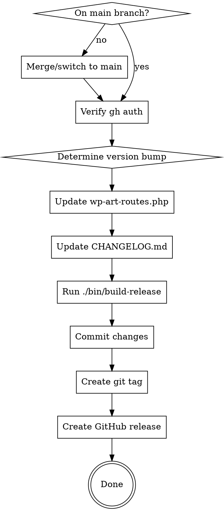

# WP Art Routes Release

## Overview

This skill guides the complete release process for the wp-art-routes WordPress plugin: version increment, changelog update, build, and GitHub release creation.

## When to Use

- User requests a new release
- User wants to bump the version
- User mentions "release", "version", "publish", or "deploy"

## Quick Reference

| Step | Files/Commands |
|------|----------------|
| Version format | `wenb-X.Y.Z` (e.g., `wenb-1.25.0`) |
| Version locations | `wp-art-routes.php` (2 places: header + constant) |
| Changelog | `CHANGELOG.md` (add entry after line 6, before first `## [wenb-` entry) |
| Build | `./bin/build-release` |
| GitHub release | `gh release create` with zip attachment |

## Release Process



### 0. Pre-Release Checks

**Branch:** Releases should be made from `main` branch. If on a feature branch:
1. Ask user: "You're on branch X. Should I merge to main first, or release from this branch?"
2. If merging: `git checkout main && git merge <branch> && git push`

**GitHub Auth:** Run `gh auth status`. If not authenticated, stop and ask user to run `gh auth login`.

### 1. Determine Version Bump

Ask user for bump type if not specified:
- **Major** (X.0.0): Breaking changes, major rewrites
- **Minor** (X.Y.0): New features, enhancements
- **Patch** (X.Y.Z): Bug fixes, small improvements

### 2. Update Version in wp-art-routes.php

Update BOTH locations:

```php
// Header comment (line ~7)
* Version: wenb-X.Y.Z

// Constant definition (line ~26)
define('WP_ART_ROUTES_VERSION', 'wenb-X.Y.Z');
```

### 3. Update CHANGELOG.md

Add new entry after line 6 (blank line after header paragraph), before the first `## [wenb-` entry:

```markdown
## [wenb-X.Y.Z] - YYYY-MM-DD

### Added
- Feature description

### Changed
- Change description

### Fixed
- Fix description
```

**Date:** Use today's date in `YYYY-MM-DD` format.

**Content sources (in priority order):**
1. User-provided release message/description
2. Git commits since last release: `git log --oneline $(git describe --tags --abbrev=0 2>/dev/null || echo HEAD~10)..HEAD`
3. Ask user if unclear

Use only relevant sections (Added/Changed/Fixed). Omit empty sections.

**Tip:** Extract changelog section for GitHub release notes later:
```bash
sed -n '/^## \[wenb-X.Y.Z\]/,/^## \[wenb-/p' CHANGELOG.md | head -n -1
```

### 4. Build Release Package

```bash
./bin/build-release
```

Creates: `build/wp-art-routes-wenb-X.Y.Z.zip`

### 5. Commit and Tag

```bash
git add wp-art-routes.php CHANGELOG.md
git commit -m "Release wenb-X.Y.Z"
git tag wenb-X.Y.Z
git push origin HEAD --tags
```

### 6. Create GitHub Release

```bash
gh release create wenb-X.Y.Z \
  --title "WP Art Routes wenb-X.Y.Z" \
  --notes-file - \
  build/wp-art-routes-wenb-X.Y.Z.zip <<'EOF'
## Changes

[Paste relevant CHANGELOG section here]

## Installation

Download the zip file and install via WordPress Admin > Plugins > Add New > Upload Plugin.
EOF
```

## Common Mistakes

| Mistake | Fix |
|---------|-----|
| Only updating one version location | Always update BOTH header and constant |
| Forgetting wenb- prefix | Version format is `wenb-X.Y.Z`, not `X.Y.Z` |
| Wrong changelog date format | Use `YYYY-MM-DD` |
| Forgetting to build before release | Build creates the zip for GitHub |
| Pushing before building | Build first, commit, then push+release |
| Releasing from feature branch | Releases typically from `main` - merge first |
| gh not authenticated | Run `gh auth status` before starting |

## Verification Checklist

Before creating release:
- [ ] On main branch (or user confirmed feature branch release)
- [ ] `gh auth status` shows logged in
- [ ] Version updated in wp-art-routes.php header (line ~7)
- [ ] Version updated in WP_ART_ROUTES_VERSION constant (line ~26)
- [ ] CHANGELOG.md has entry with correct version and date
- [ ] `./bin/build-release` ran successfully
- [ ] Zip file exists in build/ directory
